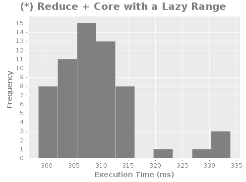
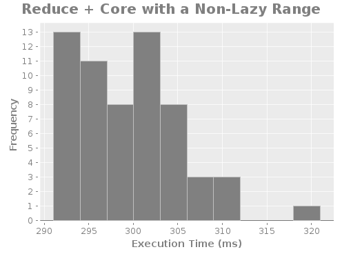

# Results

### Table

    |                 :reducer |               :lazy |           :non-lazy |
    |--------------------------+---------------------+---------------------|
    | (*) Lazy Fold + Reducers | 0.16873658383333334 | 0.17308061066666666 |
    |      (*) Fold + Reducers |  0.3080398518333333 |        0.1792540485 |
    |    (*) Reduce + Reducers | 0.32373229350000005 |  0.2978953523333333 |
    |        (*) Reduce + Core | 0.31680383883333335 |        0.3060597525 |

### Histograms

---

---

---

