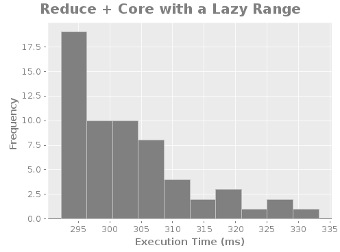
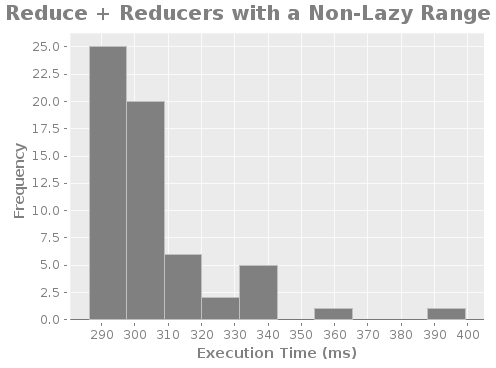
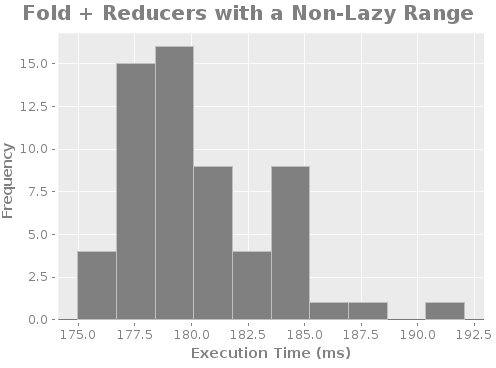
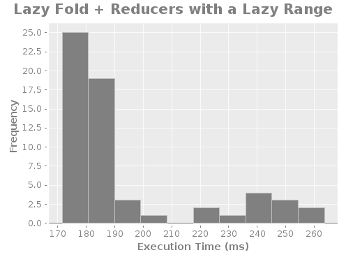
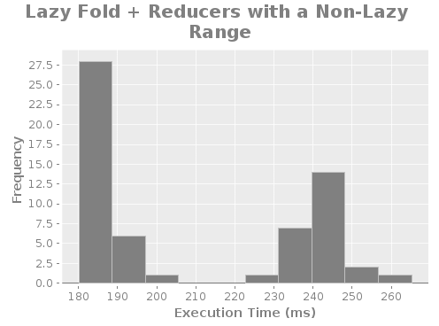

# Results

### Table

    |             :reducer |               :lazy |           :non-lazy |
    |----------------------+---------------------+---------------------|
    | Lazy Fold + Reducers | 0.20206481650000002 | 0.16218111333333335 |
    |      Fold + Reducers | 0.30272887766666673 | 0.15692892516666668 |
    |    Reduce + Reducers | 0.30376853983333335 | 0.29225454483333335 |
    |        Reduce + Core |         0.300391028 | 0.31491612116666673 |

### Histograms

---

---

---

